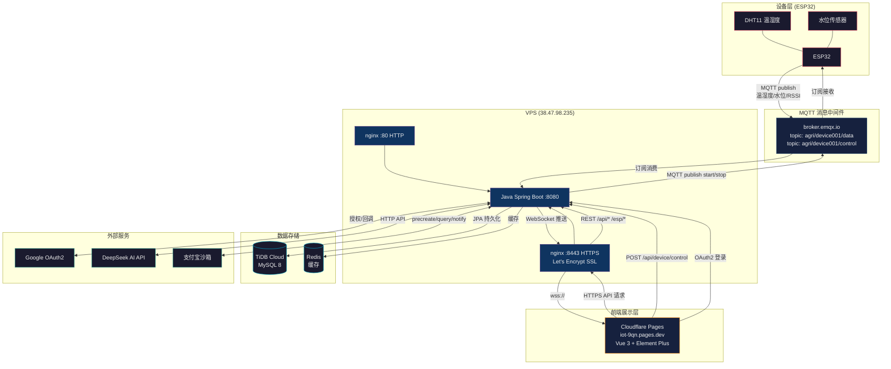

# 智慧农业 IoT 系统

## 项目概述

前后端分离的智能农业物联网系统。ESP32/ESP8266 设备通过 MQTT 上报传感器数据（温度、湿度、水位、信号强度等），后端接收并持久化，通过 WebSocket 实时推送至前端。提供设备监控、历史数据查询、设备控制、报警管理和 AI 助手功能。支持本地账号密码登录和 Google OAuth2 第三方登录。

## 子项目

| 项目 | 目录 | 技术栈 |
|------|------|--------|
| Java 后端 | [java/](java/) | Spring Boot 2.7 + MQTT + WebSocket + JPA + MySQL + Redis |
| Vue 前端 | [vue/IoT/](vue/IoT/) | Vue 3 + Element Plus + ECharts + WebSocket + axios |
| Arduino 固件 | [arduino/](arduino/) | ESP32 + DHT11 + 水位传感器 + PubSubClient |

## 系统架构



### 部署拓扑

```
ESP32 ──WiFi──▶ broker.emqx.io:1883 ◀──订阅── VPS:8080 (Java)
                                                  │
                        ┌─────────────────────────┤
                        │                         │
                  nginx :80 (HTTP)          nginx :8443 (HTTPS)
                  仅 API 代理                   SSL 终止
                  OAuth 回调入口              前端 API 入口
                        │                         │
                        └──────────┬──────────────┘
                                   │
                        Cloudflare Pages
                     iot-9qn.pages.dev
                        (Vue 3 前端)
```

## 功能模块

| 模块 | 说明 | 涉及文件 |
|------|------|----------|
| 传感器数据采集 | ESP32/ESP8266 通过 MQTT 上报，支持 JSON/纯文本两种格式 | `MqttMessageService`, `EspEntity`, `MQTT.ino` |
| 实时监控 | WebSocket 推送实时数据，前端图表动态更新 | `SensorWebSocketHandler`, `Monitor.vue` |
| 设备管理 | 设备列表、状态展示、远程启停控制 | `DeviceControlController`, `DeviceList.vue` |
| 历史数据 | 时间范围查询、图表展示、CSV 导出 | `EspController`, `History.vue` |
| 数据大屏 | 全屏实时仪表盘，适合展示大屏 | `Screen.vue` |
| 报警管理 | 报警规则 CRUD + 报警记录查看 | `Alarm.vue` |
| 自动化规则 | 条件→动作规则引擎 | `Automation.vue` |
| AI 助手 | DeepSeek API 驱动的对话助手，历史记录持久化 | `ChatController`, `Chat.vue` |
| 用户认证 | 本地注册/登录 + Google OAuth2 + JWT | `AuthController`, `Login.vue`, `Register.vue` |
| 支付宝支付 | 沙箱环境支付测试：下单→扫码→回调确认 | `AlipayController`, `Pay.vue` |

## 工作流

- **每次完成任务后必须 git commit**：前后端各自是独立仓库，完成后分别提交，commit message 使用中文描述
- **后端每个方法前必须写注释**，说明该方法的功能

## 本地开发

```bash
# 1. 启动后端 (需要 MySQL + Redis)
cd java && ./mvnw spring-boot:run        # → http://localhost:8080

# 2. 启动前端 (热更新)
cd vue/IoT && npm install && npm run dev  # → http://localhost:5173

# 3. Arduino 上传
# 用 Arduino IDE 打开 arduino/MQTT/MQTT.ino → 修改WiFi配置 → 上传到ESP32
```

前端开发时 `.env.development` 自动指向 `localhost:8080`，改代码即时生效。

## 生产部署

**前端**: Cloudflare Pages (`https://iot-9qn.pages.dev`)，连接 GitHub 仓库自动构建部署。
**后端**: VPS (`38.47.98.235`)，nginx 提供 HTTP(80) + HTTPS(8443) 双端口。

| 组件 | 地址 | 说明 |
|------|------|------|
| 前端 | `https://iot-9qn.pages.dev` | Cloudflare Pages，推送 GitHub 自动部署 |
| 后端 HTTP | `http://38.47.98.235` | 端口 80，OAuth 回调用 |
| 后端 HTTPS | `https://38.47.98.235.nip.io:8443` | 端口 8443，Let's Encrypt 证书 |

```bash
# 更新后端 (手动部署)
cd java && ./mvnw clean package -DskipTests
scp target/IoTSystem-0.0.1-SNAPSHOT.jar root@38.47.98.235:/opt/iot/
ssh root@38.47.98.235 "systemctl restart iot"

# 更新前端 (推送 GitHub → Cloudflare Pages 自动构建)
git add . && git commit -m "描述改动" && git push origin main
```

**前端构建** (Cloudflare Pages 自动执行):
- 构建命令: `cd vue/IoT && npm install && npm run build`
- 输出目录: `vue/IoT/dist`

## 前置依赖

| 依赖 | 版本 | 用途 |
|------|------|------|
| JDK | 8+ | 后端运行环境 |
| MySQL | 8.0 / TiDB Cloud | 数据库 |
| Redis | 5+ | 缓存 |
| Node.js | 16+ | 前端构建 |
| Arduino IDE | 2.x | ESP32 固件上传 |
