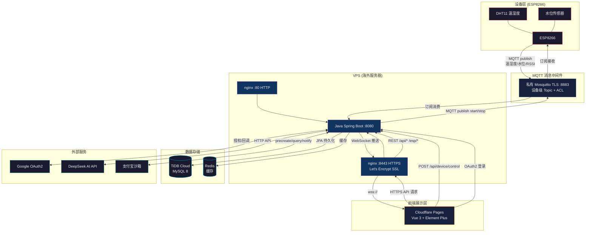

# 智慧农业 IoT 系统 — 项目参考

> 每次会话自动加载的是 [CLAUDE.md](CLAUDE.md)，本文件仅在深入了解项目细节时需要查阅。

## 系统架构



### 部署拓扑

```
ESP8266 ──MQTT TLS──▶ 私有 Broker ──订阅──▶ Java ──JPA──▶ 云数据库
                                       │
            ┌──────────────────────────┤
            │                          │
      nginx (HTTP)              nginx (HTTPS)
       仅 API 代理                SSL 终止 + WSS
            │                          │
            └──────────┬───────────────┘
                       │
               Cloudflare Pages
                  (Vue 3 前端)
```

## 功能模块

| 模块 | 说明 | 涉及文件 |
|------|------|----------|
| 传感器数据采集 | ESP8266 通过设备级 MQTT TLS Topic 上报，后端校验设备身份 | `MqttMessageService`, `EspEntity`, `MQTT.ino` |
| 实时监控 | WebSocket 推送实时数据，前端图表动态更新 | `SensorWebSocketHandler`, `Monitor.vue` |
| 设备管理 | 设备列表、状态展示、远程启停控制 | `DeviceControlController`, `DeviceList.vue` |
| 历史数据 | 设备/时间组合查询、异常质量标记、保留策略和全量 CSV 导出 | `SensorHistoryService`, `SensorDataRetentionService`, `History.vue` |
| 数据大屏 | 全屏实时仪表盘，适合展示大屏 | `Screen.vue` |
| 报警管理 | 报警规则 CRUD + 报警记录查看 | `Alarm.vue` |
| 自动化规则 | 持久化条件引擎，支持防抖、冷却、停用和执行审计 | `AutomationService`, `Automation.vue` |
| AI 助手 | DeepSeek API 驱动的对话助手，历史记录持久化 | `ChatController`, `Chat.vue` |
| 用户认证 | 本地注册/登录 + Google OAuth2 + JWT | `AuthController`, `Login.vue`, `Register.vue` |
| 支付宝支付 | 沙箱环境支付测试：下单→扫码→回调确认 | `AlipayController`, `Pay.vue` |

## 前置依赖

| 依赖 | 版本 | 用途 |
|------|------|------|
| JDK | 8+ | 后端运行环境 |
| MySQL | 8.0 / TiDB Cloud | 数据库 |
| Redis | 5+ | 缓存 |
| Node.js | 16+ | 前端构建 |
| Arduino IDE | 2.x | ESP8266 固件上传 |

## 子项目详细文档

- Java 后端: [java/CLAUDE.md](java/CLAUDE.md)
- Vue 前端: [vue/IoT/CLAUDE.md](vue/IoT/CLAUDE.md)
