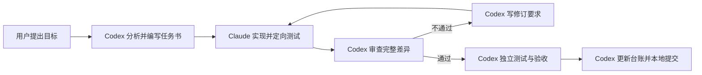

# Codex 主导、Claude 实现协作流程

## 目标

Codex 负责需求分析、方案设计、任务拆分、代码审查和最终验收；Claude Code 通过 DeepSeek API 负责边界明确的编码与定向测试。该流程减少 Codex 在机械实现上的上下文消耗，同时保留统一的架构决策、质量门禁和提交责任。

Claude/DeepSeek 会接收任务提示和完成任务所需的项目代码。不得向 worker 提供生产凭据、用户隐私数据或未脱敏日志。

## 职责边界

| 角色 | 必须负责 | 不得委托或擅自执行 |
|---|---|---|
| 用户 | 确认目标、优先级和高风险外部操作 | 无需参与普通代码细节 |
| Codex | 设计结果与流程、编写任务书、确定验收标准、审查完整差异、独立验证、更新台账、创建提交 | 不以 Claude 的“已完成”代替自己的验收 |
| Claude worker | 按任务书修改允许的文件、运行定向测试、报告结果和风险 | 改需求、改协作规则、提交、推送、部署、访问凭据、写生产数据库或控制硬件 |



## 标准执行流程

1. Codex 先读取项目规则、任务台账、相关代码和 `git status`。
2. Codex 从 `.ai/tasks/TEMPLATE.md` 生成 `.ai/tasks/current.md`，必须写清目标、允许路径、禁止范围、验收标准和测试命令。
3. Codex 执行 `./scripts/claude_worker.sh`。脚本使用非交互 `claude -p`、`dontAsk` 权限模式、工具白名单、禁止规则和 PreToolUse 守卫。
4. Claude 直接修改工作区并输出 `.ai/reports/latest.md`；原始 JSON、会话 ID 和调用元数据保存在 `.ai/reports/latest.raw.json`。
5. Codex 检查任务前基线、完整 `git diff`、新增依赖、错误处理、权限边界和测试真实性。
6. 审查不通过时，Codex 更新任务书中的修订要求。可设置 `CLAUDE_WORKER_RESUME_ID` 延续上一会话，减少重复上下文。
7. 审查通过后，Codex独立运行必要测试和构建，更新任务台账并创建本地提交。除非用户明确授权，否则不推送或部署。

## 常用命令

```bash
# 1. 创建本轮任务书
cp .ai/tasks/TEMPLATE.md .ai/tasks/current.md

# 2. Codex 填写任务书后启动 Claude worker
./scripts/claude_worker.sh

# 3. 查看 Claude 的精简报告
sed -n '1,220p' .ai/reports/latest.md

# 4. 审查后要求同一 Claude 会话修订
export CLAUDE_WORKER_RESUME_ID="$(jq -r '.session_id' .ai/reports/latest.raw.json)"
./scripts/claude_worker.sh
unset CLAUDE_WORKER_RESUME_ID
```

可通过 `CLAUDE_WORKER_MAX_TURNS` 限制单次最多代理轮数；默认值为 40。若当前 DeepSeek 网关支持 Claude Code 的费用元数据，也可以设置 `CLAUDE_WORKER_MAX_BUDGET_USD`。

## Codex 审查清单

- 需求是否逐项实现，是否有未经批准的范围扩张。
- 修改是否符合既有架构、命名、接口、数据和时间语义。
- 是否存在更简单的实现、重复逻辑、调试代码、无用依赖或大范围格式变化。
- 输入、异常、认证、授权、用户归属、并发、重试和幂等边界是否正确。
- 是否修改或读取凭据、协作规则、Git 历史、部署配置或任务书。
- Claude 声称执行的测试是否有真实输出，Codex 是否独立复验关键命令。
- `git diff --check`、完整差异和最终 `git status` 是否符合预期。

## 并发和终端限制

- Codex 无法附着到普通 macOS Terminal 中已经运行的 Claude 交互会话；受管任务由脚本启动新的非交互会话并捕获输出。
- `scripts/claude_worker.sh` 使用目录锁防止两个受管 worker 同时运行，但无法约束手动打开的 Claude 窗口。
- 运行受管 worker 时，不要在现有 Claude、IDE 自动代理或其他终端中同时修改相同文件。
- 若工作区开始时已有用户改动，Codex 应把基线写入任务书；Claude 与 Codex 都不得回滚这些改动。

## 失败处理

- Claude API、DeepSeek 网关或权限规则失败时，worker 必须退出并保留原始输出，不能伪造完成状态。
- Claude 被安全规则阻止后，Codex判断该动作是否确有必要；必要时由 Codex在用户授权范围内执行，不放宽 worker 的长期权限。
- 如果 Claude连续两轮仍未满足同一验收项，Codex停止委派，直接定位根因或重新设计任务，不继续消耗上下文。
